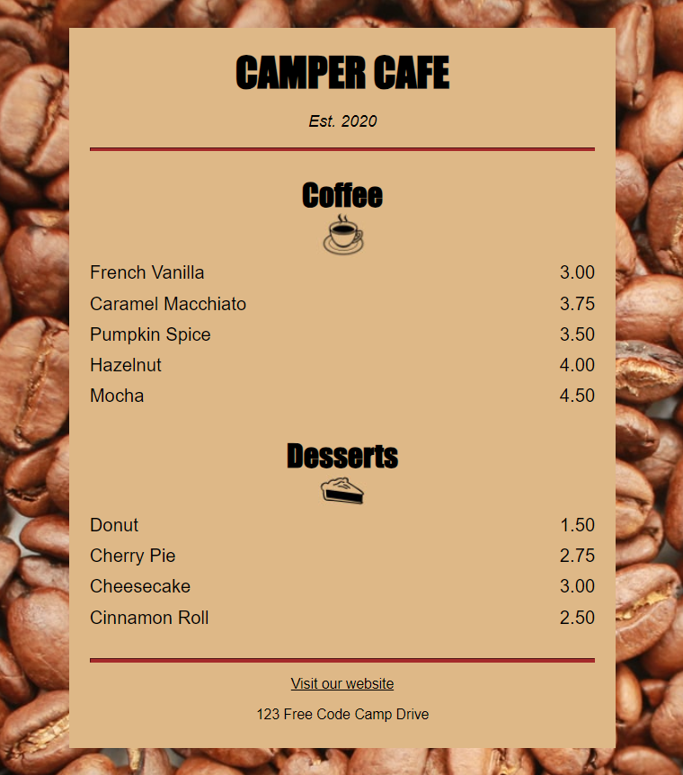

# Camper Cafe
A simple HTML and CSS café menu web application created as part of the FreeCodeCamp Responsive Web Design certification course.

## Description
This project is designed to showcase basic HTML and CSS skills, featuring a café menu with various offerings. It serves as a learning exercise from FreeCodeCamp's curriculum.

## Features
- Displays a variety of café menu items.
- Provides organized and visually appealing layout.
- Responsive design for different screen sizes.

## Technologies Used
- HTML
- CSS

## How to Run
1. Clone the repository to your local machine.
2. Open `camperCafe.html` in your web browser.

## Acknowledgments
This project was completed as part of the FreeCodeCamp Responsive Web Design certification course. Special thanks to FreeCodeCamp for providing the resources and guidance.
